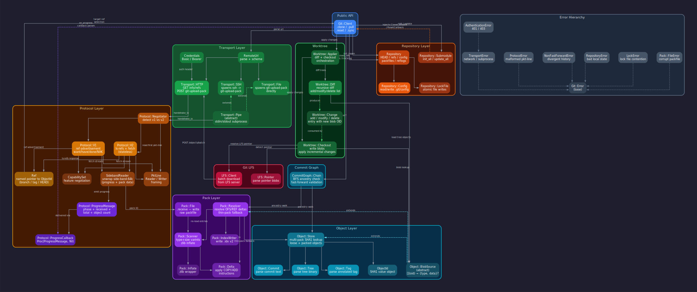

# Architecture

---

## Layers

- **Public API** — `Git::Client` is the single entry point for consumers. It exposes clone, pull, reset, and sync, and orchestrates all other layers. No other layer is intended for direct use by library consumers.

- **Transport** — Abstracts over HTTP/HTTPS, SSH, and `file://` connections. Responsible solely for establishing the raw byte stream to a remote `git-upload-pack` process. Authentication (Basic/Bearer) is applied here for HTTP; SSH uses agent forwarding. Push is not supported. SSH and File transports share a `Pipe` base that manages the subprocess lifecycle; HTTP connects directly.

- **Protocol** — Speaks the git wire protocol over the IO stream the Transport provides. Detects and negotiates v1 (ref-advertisement, want/have/done) or v2 (stateless ls-refs + fetch). Both versions produce the same output — a ref list and a pack stream — so callers never need to know which was used. `SidebandReader` demultiplexes pack data from progress messages; `PktLine` handles the low-level framing.

- **Pack** — Receives the raw pack stream and produces a resolved, indexed object set. `Scanner` iterates entries and inflates zlib data. `Resolver` reconstructs delta chains (OFS\_DELTA and REF\_DELTA) and handles thin packs by falling back to the local store for missing base objects. `IndexWriter` writes a v2 `.idx` file for O(log n) future lookups. This layer deals only in types and raw bytes — it does not parse object content.

- **Object** — Parses raw bytes into typed git objects (commit, tree, tag, blob). `Store` implements multi-pack and loose-object lookup for an existing on-disk repository. `BlobSource` is an abstract lookup interface satisfied by both `Store` and `Pack::Resolver`; Worktree and CommitGraph depend on this interface rather than either concrete type.

- **Repository** — Owns the `.git` directory: HEAD, packed-refs, branch refs, remote-tracking refs, FETCH\_HEAD, ORIG\_HEAD, config, reflogs, shallow file, and atomic lock-file writes. Does not interpret object content and does not touch the working tree. `Submodule` parses `.gitmodules` and coordinates init/update; it has no hard dependency on `Client` — clone and reset operations are injected as callbacks.

- **Worktree** — Applies object content to the filesystem. `Diff` computes a flat add/modify/delete list by recursively comparing two tree OIDs. `Checkout` writes blob content, sets executable bits, creates symlinks, and resolves LFS pointers. `Applier` orchestrates the two: given two commit OIDs and a blob source, it diffs and applies in one call. This is the only layer that writes files during normal operation; ref state is managed by the caller afterward.

- **Commit Graph** — `CommitGraph::Chain` performs BFS ancestry checks to validate fast-forward relationships. Reads a pre-built commit-graph file when available (O(1) parent lookups) and falls back to object store reads otherwise. No dependency on Transport, Protocol, or Worktree.

- **Git LFS** — `LFS::Client` handles the LFS Batch API (REST + JSON over HTTPS), intentionally separate from the Transport layer because LFS speaks a different protocol to the git wire format. `LFS::Pointer` parses pointer blobs that appear in-tree for LFS-tracked files. The HTTP client is injectable for testing without a live server.

- **Error Hierarchy** — All errors extend `Git::Error`. Domain subclasses carry semantic meaning: `NonFastForwardError` (diverged history), `AuthenticationError` (HTTP 401/403), `TransportError` (network/subprocess), `ProtocolError` (malformed wire data), `RepositoryError`, `LockError`, `Pack::FileError`. Callers catch the base class for broad handling or specific subclasses when the distinction matters.

---

## Data flows

### Clone

1. `Client.clone` parses the URL and selects a transport (HTTP, SSH, or File).
2. The transport opens a connection; Protocol negotiates v1 or v2 and fetches the full ref list.
3. Protocol fetches all objects reachable from the target ref's OID, streaming a pack file to disk.
4. Pack resolves and indexes the pack, writing a `.pack` and `.idx` pair.
5. Worktree::Applier checks out the commit tree: Diff produces a full add-list (empty → target tree), Checkout writes every blob.
6. Repository writes HEAD, packed-refs, config, remote-tracking refs, and the initial reflog entries.
7. If LFS blobs are present, `LFS::Client` batch-downloads them and replaces the pointer files in place.
8. If submodules are declared, Submodule reads `.gitmodules`, resolves gitlink OIDs, and invokes the injected clone callback for each.

### Pull / Reset / Sync

1. `Client.pull` (or reset/sync) opens the existing repository and reads the remote URL from config.
2. The transport connects and Protocol negotiates an incremental fetch: only objects the local repo lacks are transferred.
3. Pack resolves and indexes the new objects; a `ComposedBlobSource` is built from the new pack (primary) and the local store (fallback).
4. CommitGraph checks that the remote tip is an ancestor of the local tip (fast-forward validation; skipped for reset/sync).
5. Worktree::Applier diffs the two commit trees and applies the delta to the working tree.
6. Repository updates HEAD, branch refs, remote-tracking refs, FETCH\_HEAD, and reflogs.
7. LFS and submodule post-processing mirrors the clone path.

---

## Key abstractions

### Object::BlobSource

Both the on-disk object store and a freshly received pack expose the same lookup: given an OID, return the object type and raw bytes, or nil if not found. `BlobSource` formalises this as an abstract interface. Code in the Worktree and CommitGraph layers depends on this interface, not on either concrete backing store. When a pull operation needs objects that might be in the new pack *or* in the existing store, a `ComposedBlobSource` chains them transparently — the caller sees a single source.

### Proc injection (Submodule callbacks)

`Repository::Submodule` needs to recursively clone and reset submodules, but it must not depend on `Client` (which would create a circular dependency). Instead, callers inject the clone and reset operations as named callback types (`CloneCallback`, `ResetCallback`, `PinCallback`). The Submodule module calls the injected procs without knowing their implementation. This pattern documents the dependency boundary explicitly in the type system.

### Protocol::Session (V1 / V2 polymorphism)

`Protocol::Negotiator` inspects the initial server response and returns either a `V1` or `V2` session. Both implement the same `Session` interface: `refs` returns the advertised references, `fetch` streams the requested objects. The rest of the system — including `Client` — only ever sees a `Session` and is unaffected by which wire-protocol version the server selected.

### Transport::Pipe (SSH / File subprocess)

SSH and File transports both communicate with a `git-upload-pack` subprocess over stdio. The shared `Pipe` base class manages process lifecycle, stdin/stdout forwarding, and error propagation. Each concrete subclass is responsible only for the command it spawns (e.g., `ssh host git-upload-pack path` vs. `git-upload-pack path` directly). The Protocol layer then reads from the resulting IO without caring whether it is a socket or a pipe.
